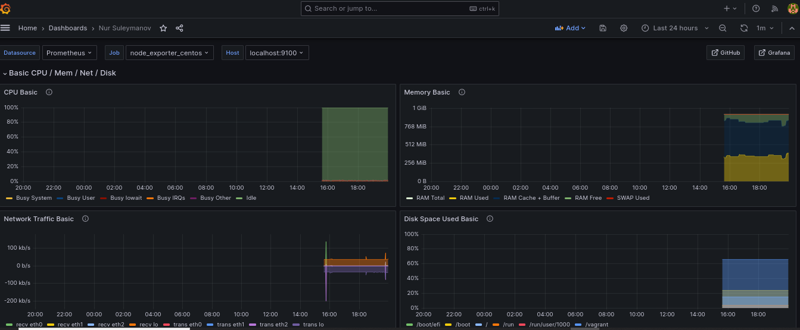

# Домашняя работа: Мониторинг и алертинг

	Цель работы: Научиться настраивать дашборд.

	Что нужно сделать?

	Настроить дашборд с ч-мя графиками:
	- память
	- процессор
	- диск
	- сеть
 
	Настроить на одной из систем:

    - zabbix (использовать screen (комплексный экран);
    - prometheus - grafana.
	
# Выполнение

